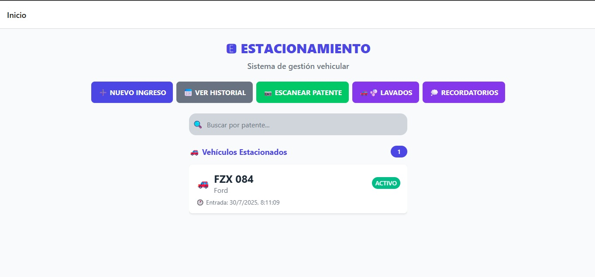
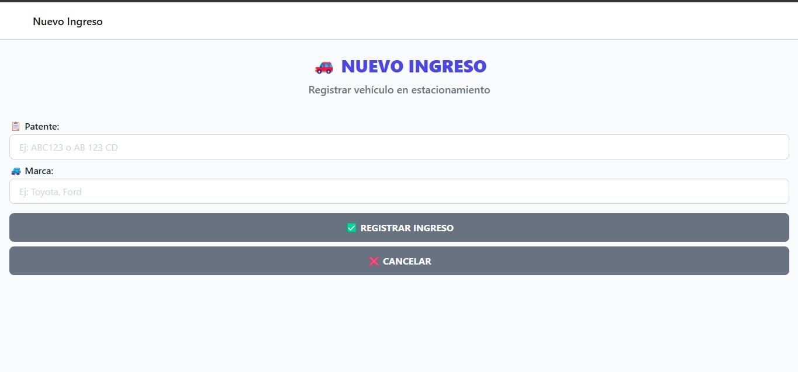
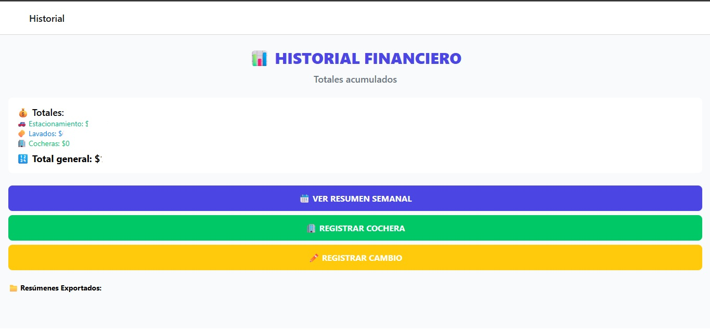
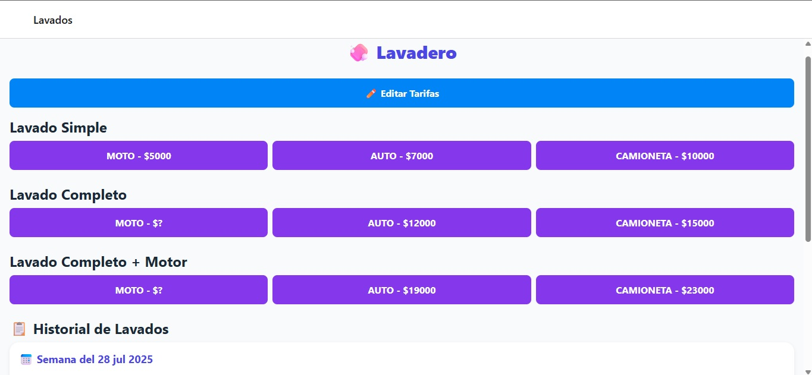
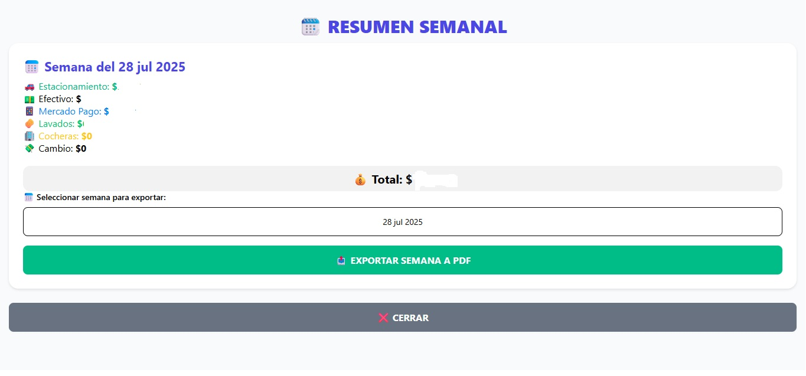
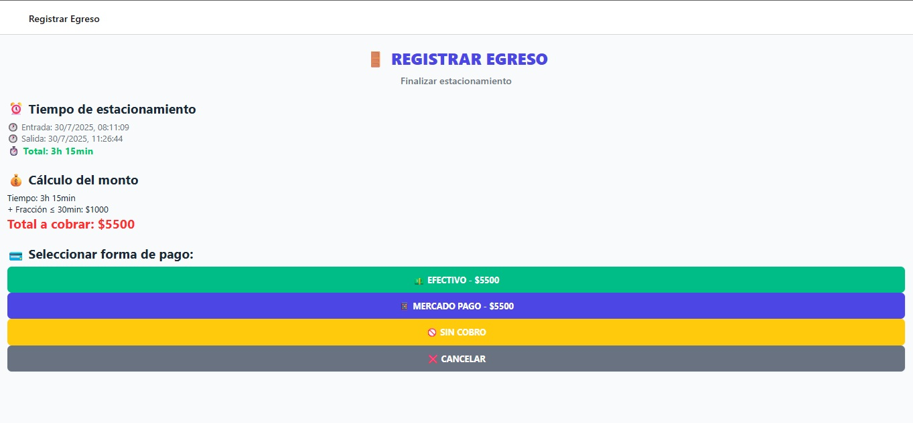

# 🏠 App de Estacionamiento

Aplicación móvil y web desarrollada con React Native y Firebase para la gestión de entradas y salidas de vehículos, servicios de lavado, pagos mensuales, recordatorios y escaneo de patentes mediante OCR.

---

## ✨ Características Principales

* Registro de ingresos y egresos de vehículos.
* Detección de patentes mediante cámara o galería usando OCR.
* Identificación de cocheras mensuales.
* Registro y edición de lavados por tipo de vehículo.
* Generación de resúmen financiero semanal.
* Exportación a PDF.
* Registro de recordatorios importantes.

---

## 📂 Estructura del Proyecto

```
.
├── App.js                     # Navegación principal con react-navigation
├── firebase.js               # Configuración de Firebase
├── styles/                   # Estilos globales, responsive y personalizados
├── scripts/screens/          # Pantallas de la app
│   ├── HomeScreen.js
│   ├── ExitScreen.js
│   ├── NewEntryScreen.js
│   ├── HistoryScreen.js
│   ├── CameraOCRScreen.js
│   ├── LavadoScreen.js
│   └── RecordatorioScreen.js
└── api/                      # API externa para OCR (usando Vercel)
    └── plate.js
```

---

## ⚡ Tecnologías Usadas

* **React Native + Expo**
* **Firebase** (Firestore + Hosting)
* **Vercel** (para el backend de OCR)
* **PlateRecognizer** (servicio de OCR)

---

## ⚙ Instalación y Ejecución Local

```bash
# Clonar el repositorio
https://github.com/tu-usuario/estacionamiento-app.git

# Instalar dependencias
npm install

# Correr en modo desarrollo con Expo
npx expo start
```

> ✅ Requiere tener instalado `expo-cli`

---

## 🚀 Despliegue Web

```bash
# Exportar versión web
npx expo export --platform web

# Subir a Firebase Hosting
firebase deploy
```

---

## ✨ Funcionalidades por Pantalla

### HomeScreen

* Acceso a todas las funcionalidades principales.

### NewEntryScreen / ExitScreen

* Registrar ingresos y egresos.
* Calcular tiempo y monto a pagar.

### CameraOCRScreen

* Usar cámara o galería para escanear patentes.
* Verificación contra base de datos de mensuales.

### LavadoScreen

* Registrar servicios de lavado por tipo.
* Editar tarifas y ver historial.

### HistoryScreen

* Resumen financiero semanal.
* Exportación a PDF.

### RecordatorioScreen

* Registro de fechas y eventos importantes.
* Notificación diaria según fecha.

---

## 🖼️ Capturas de Pantalla

### Pantalla de Inicio


### Nuevo Ingreso


### Escaneo de Patente (OCR)


### Historial Financiero


### Lavados


### Recordatorios


### Resumen Semanal


### Egreso



---

## 📂 Firestore - Estructura de Colecciones

* `autos` - Historial de ingresos y egresos.
* `lavados` - Registro de servicios de lavado.
* `cocheras` - Patentes de cocheras mensuales.
* `recordatorios` - Eventos importantes con fecha.
* `resumenes` - Historial de PDFs exportados.
* `tarifas` - Tarifas de los lavados.
* `mensuales` - Autos con cocheras mensuales.


---

## 🔐 Seguridad

Este repositorio público:

- ✅ No contiene claves de Firebase ni configuración privada
- ✅ No incluye funciones backend ni scripts internos
- ✅ Está pensado solo para mostrar el funcionamiento general

---

## 🎯 Propósito

Proyecto desarrollado como práctica profesional.  
No habilitado para uso comercial sin autorización del autor.

---

## 🔍 Mejoras Futuras

* Autenticación por usuarios.
* Panel de administrador web.
* Estadísticas visuales.

---

## 🙏 Agradecimientos

* Expo
* Firebase
* PlateRecognizer
* Vercel

---

## 📥 Licencia

Este proyecto es de código cerrado. Uso interno autorizado para administración de estacionamiento + lavadero.

---

## 📬 Contacto
¿Te interesa ver la app funcionando o contratar desarrollo personalizado?

Mandame un correo y te muestro la versión completa en funcionamiento.